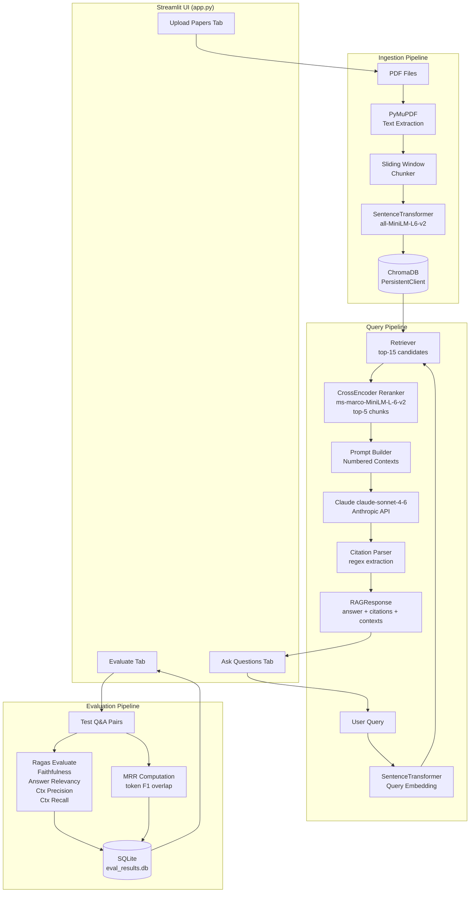
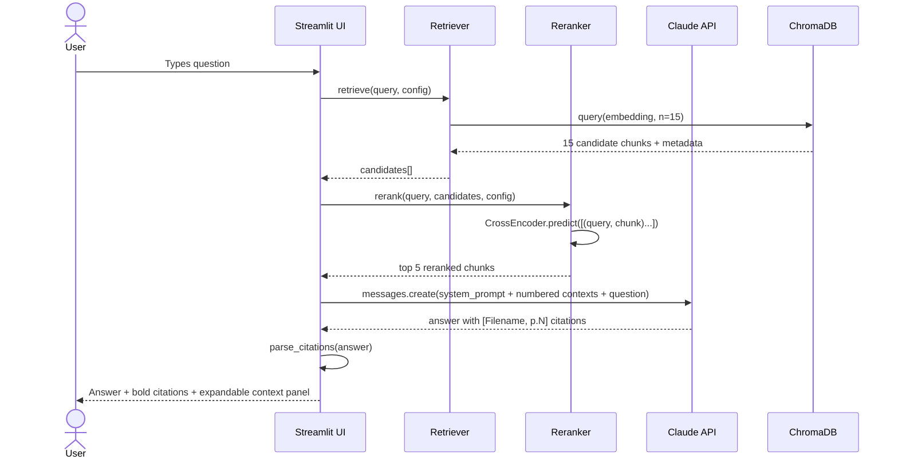
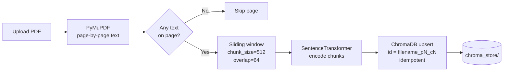
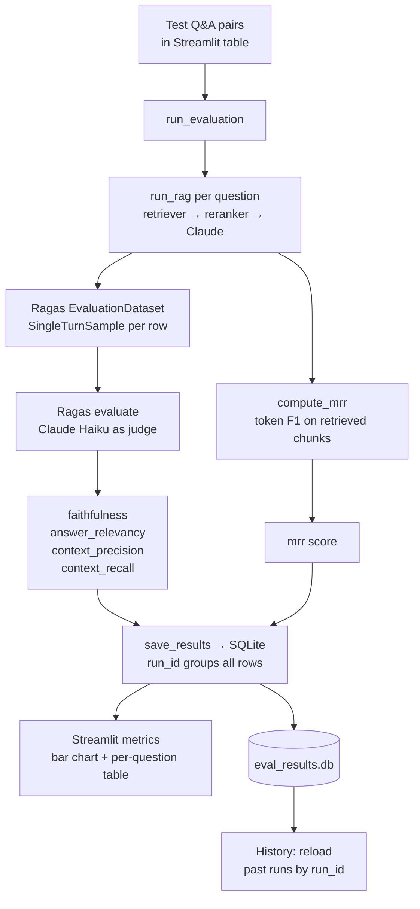
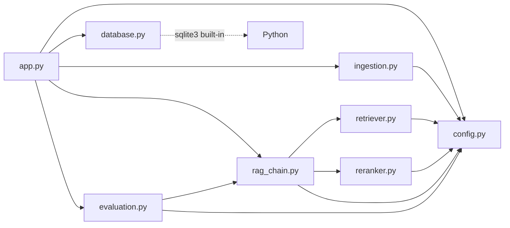

# Architecture & Flow Diagrams

## System Architecture

```mermaid
graph TB
    subgraph UI["Streamlit UI (app.py)"]
        T1[Upload Papers Tab]
        T2[Ask Questions Tab]
        T3[Evaluate Tab]
    end

    subgraph Ingestion["Ingestion Pipeline"]
        PDF[PDF Files]
        PYMUPDF[PyMuPDF\nText Extraction]
        CHUNK[Sliding Window\nChunker]
        EMBED_I[SentenceTransformer\nall-MiniLM-L6-v2]
        CHROMA[(ChromaDB\nPersistentClient)]
    end

    subgraph Query["Query Pipeline"]
        QUERY[User Query]
        EMBED_Q[SentenceTransformer\nQuery Embedding]
        RETRIEVE[Retriever\ntop-15 candidates]
        RERANK[CrossEncoder Reranker\nms-marco-MiniLM-L-6-v2\ntop-5 chunks]
        PROMPT[Prompt Builder\nNumbered Contexts]
        CLAUDE[Claude claude-sonnet-4-6\nAnthropic API]
        PARSE[Citation Parser\nregex extraction]
        RESPONSE[RAGResponse\nanswer + citations + contexts]
    end

    subgraph Evaluation["Evaluation Pipeline"]
        TESTCASES[Test Q&A Pairs]
        RAGAS[Ragas Evaluate\nFaithfulness\nAnswer Relevancy\nCtx Precision\nCtx Recall]
        MRR[MRR Computation\ntoken F1 overlap]
        SQLITE[(SQLite\neval_results.db)]
    end

    T1 --> PDF
    PDF --> PYMUPDF --> CHUNK --> EMBED_I --> CHROMA

    T2 --> QUERY --> EMBED_Q --> RETRIEVE
    CHROMA --> RETRIEVE --> RERANK --> PROMPT --> CLAUDE --> PARSE --> RESPONSE --> T2

    T3 --> TESTCASES --> RAGAS
    TESTCASES --> MRR
    RAGAS --> SQLITE
    MRR --> SQLITE
    SQLITE --> T3
```

---

## Query Flow (Step-by-Step)

```mermaid
sequenceDiagram
    actor User
    participant UI as Streamlit UI
    participant Ret as Retriever
    participant Rer as Reranker
    participant LLM as Claude API
    participant DB as ChromaDB

    User->>UI: Types question
    UI->>Ret: retrieve(query, config)
    Ret->>DB: query(embedding, n=15)
    DB-->>Ret: 15 candidate chunks + metadata
    Ret-->>UI: candidates[]

    UI->>Rer: rerank(query, candidates, config)
    Rer->>Rer: CrossEncoder.predict([(query, chunk)...])
    Rer-->>UI: top 5 reranked chunks

    UI->>LLM: messages.create(system_prompt + numbered contexts + question)
    LLM-->>UI: answer with [Filename, p.N] citations

    UI->>UI: parse_citations(answer)
    UI-->>User: Answer + bold citations + expandable context panel
```

---

## Ingestion Flow

```mermaid
flowchart LR
    A[Upload PDF] --> B[PyMuPDF\npage-by-page text]
    B --> C{Any text\non page?}
    C -- No --> D[Skip page]
    C -- Yes --> E[Sliding window\nchunk_size=512\noverlap=64]
    E --> F[SentenceTransformer\nencode chunks]
    F --> G[ChromaDB upsert\nid = filename_pN_cN\nidempotent]
    G --> H[(chroma_store/)]
```

---

## Evaluation Flow

```mermaid
flowchart TD
    A[Test Q&A pairs\nin Streamlit table] --> B[run_evaluation]
    B --> C[run_rag per question\nretriever → reranker → Claude]
    C --> D[Ragas EvaluationDataset\nSingleTurnSample per row]
    C --> E[compute_mrr\ntoken F1 on retrieved chunks]
    D --> F[Ragas evaluate\nClaude Haiku as judge]
    F --> G[faithfulness\nanswer_relevancy\ncontext_precision\ncontext_recall]
    E --> H[mrr score]
    G --> I[save_results → SQLite\nrun_id groups all rows]
    H --> I
    I --> J[Streamlit metrics\nbar chart + per-question table]
    I --> K[(eval_results.db)]
    K --> L[History: reload\npast runs by run_id]
```

---

## Module Dependency Map

```mermaid
graph LR
    app.py --> config.py
    app.py --> ingestion.py
    app.py --> rag_chain.py
    app.py --> evaluation.py
    app.py --> database.py

    ingestion.py --> config.py
    retriever.py --> config.py
    reranker.py --> config.py
    rag_chain.py --> config.py
    rag_chain.py --> retriever.py
    rag_chain.py --> reranker.py
    evaluation.py --> config.py
    evaluation.py --> rag_chain.py
    database.py -.->|sqlite3 built-in| Python
```
